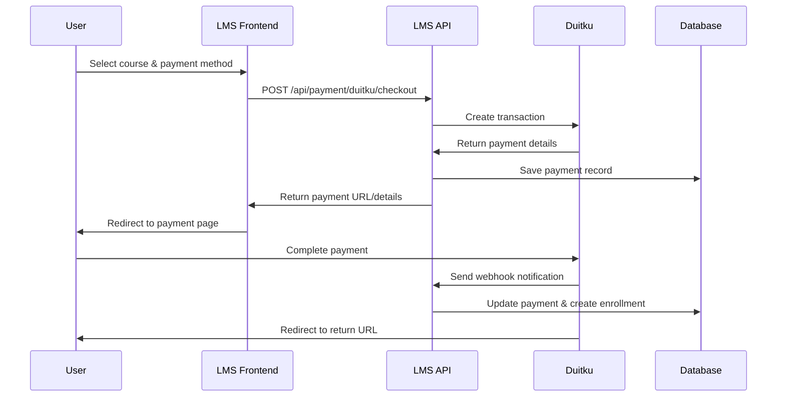

# Duitku Payment Gateway Integration Guide

## Overview

This guide explains how to integrate and use the Duitku payment gateway in the LMS system. Duitku is an Indonesian payment gateway that supports various local payment methods including Virtual Accounts, e-wallets, and other popular Indonesian payment options.

## 🚀 Quick Start

### 1. Fix Registration Issue First

Before using Duitku payments, you need to fix the Supabase registration issue:

1. **Apply the updated trigger in Supabase SQL Editor:**

   ```sql
   -- Run the contents of supabase-trigger.sql
   -- This fixes the column name mismatch that was causing registration failures
   ```

2. **Test registration:**
   - Try registering a new user at `/auth/signup`
   - Check the server logs for success messages
   - Use the debug endpoint: `GET /api/debug/registration`

### 2. Environment Setup

Add these variables to your `.env.local`:

```bash
# Duitku Configuration
DUITKU_MERCHANT_CODE="DS24219"
DUITKU_API_KEY="d2547323e018a40ddfd10d81923823ca"
NEXT_PUBLIC_APP_URL="http://localhost:3000"
```

### 3. Test the Integration

1. **Get Payment Methods:**

   ```bash
   curl "http://localhost:3000/api/payment/duitku/methods?amount=100000"
   ```

2. **Create Test Payment:**
   - Visit any course page
   - Click "Enroll Now"
   - Fill in payment form
   - Select a payment method
   - Complete the payment flow

## 📋 Architecture

### API Endpoints

#### 1. Get Payment Methods

**Endpoint:** `GET /api/payment/duitku/methods`
**Parameters:**

- `courseId` (optional): Course ID to get price
- `amount` (optional): Direct amount in IDR

**Response:**

```json
{
  "success": true,
  "paymentMethods": [
    {
      "paymentMethod": "BC",
      "paymentName": "BCA Virtual Account",
      "paymentImage": "https://images.duitku.com/...",
      "totalFee": "0",
      "displayName": "BCA Virtual Account",
      "formattedFee": "Free"
    }
  ],
  "amount": 100000,
  "formattedAmount": "Rp 100.000"
}
```

#### 2. Create Payment Transaction

**Endpoint:** `POST /api/payment/duitku/checkout`
**Body:**

```json
{
  "courseId": "course-id",
  "paymentMethod": "BC",
  "customerInfo": {
    "firstName": "John",
    "lastName": "Doe",
    "phoneNumber": "081234567890",
    "address": "Jakarta",
    "city": "Jakarta",
    "postalCode": "12345"
  }
}
```

**Response:**

```json
{
  "success": true,
  "payment": {
    "merchantOrderId": "LMS-1704067200000-ABC123",
    "reference": "DUITKU-REF-123",
    "amount": 100000,
    "formattedAmount": "Rp 100.000",
    "paymentMethod": "BC",
    "paymentMethodName": "BCA Virtual Account",
    "paymentUrl": "https://sandbox.duitku.com/...",
    "vaNumber": "1234567890",
    "expiryMinutes": 60
  },
  "course": {
    "id": "course-id",
    "title": "Course Title"
  }
}
```

#### 3. Check Payment Status

**Endpoint:** `GET /api/payment/duitku/status?merchantOrderId=ORDER_ID`

**Response:**

```json
{
  "success": true,
  "payment": {
    "merchantOrderId": "LMS-1704067200000-ABC123",
    "status": "COMPLETED",
    "isCompleted": true,
    "duitkuStatus": "00",
    "duitkuMessage": "SUCCESS"
  },
  "enrollment": {
    "isEnrolled": true,
    "hasAccess": true
  },
  "actions": {
    "canAccess": true,
    "needsPayment": false
  }
}
```

#### 4. Webhook Handler

**Endpoint:** `POST /api/webhook/duitku`

- Automatically processes payment notifications
- Updates payment status
- Creates course enrollments
- Validates signatures for security

### Payment Flow



## 🏗️ Implementation Details

### Core Components

#### 1. Duitku Helper Library (`lib/duitku.ts`)

- **Signature Generation**: MD5 and SHA256 hashing for API security
- **API Calls**: Get methods, create transactions, check status
- **Utilities**: Currency formatting, validation, URL generation

#### 2. Payment Methods Support

The integration supports all major Indonesian payment methods:

- **Virtual Accounts**: BCA, Mandiri, BNI, BRI, Maybank
- **E-Wallets**: ShopeePay, OVO, DANA, LinkAja, GoPay
- **Retail**: Indomaret, Alfamart
- **Credit Cards**: Visa, Mastercard
- **QRIS**: Universal QR payments
- **Buy Now Pay Later**: Kredivo, Indodana

#### 3. Database Integration

```sql
-- Payment records use existing Payment model
CREATE TABLE payments (
  id VARCHAR PRIMARY KEY,  -- Merchant Order ID
  userId UUID REFERENCES users(id),
  courseId VARCHAR REFERENCES courses(id),
  stripePaymentId VARCHAR,  -- Stores Duitku reference
  amount FLOAT,
  currency VARCHAR DEFAULT 'idr',
  status PaymentStatus,  -- PENDING, COMPLETED, FAILED
  createdAt TIMESTAMP,
  updatedAt TIMESTAMP
);

-- Enrollments created automatically on successful payment
CREATE TABLE enrollments (
  id VARCHAR PRIMARY KEY,
  userId UUID REFERENCES users(id),
  courseId VARCHAR REFERENCES courses(id),
  createdAt TIMESTAMP,
  UNIQUE(userId, courseId)
);
```

### Security Features

#### 1. Signature Validation

All API calls use signature validation:

```typescript
// For transaction creation
const signature = MD5(merchantCode + merchantOrderId + paymentAmount + apiKey);

// For webhook validation
const signature = MD5(merchantCode + amount + merchantOrderId + apiKey);
```

#### 2. Authentication

- All payment APIs require user authentication
- Bearer token validation for API access
- User ownership verification for payment records

#### 3. Data Validation

- Amount validation (IDR 1,000 - 50,000,000)
- Required field validation
- Course availability checks
- Duplicate enrollment prevention

## 🧪 Testing

### 1. Test Registration First

```bash
# Test the registration debug endpoint
curl "http://localhost:3000/api/debug/registration"

# Test actual registration
curl -X POST "http://localhost:3000/api/auth/register" \
  -H "Content-Type: application/json" \
  -d '{
    "email": "test@example.com",
    "password": "password123",
    "name": "Test User"
  }'
```

### 2. Test Payment Flow

```bash
# 1. Get available payment methods
curl "http://localhost:3000/api/payment/duitku/methods?amount=50000" \
  -H "Authorization: Bearer YOUR_TOKEN"

# 2. Create payment transaction
curl -X POST "http://localhost:3000/api/payment/duitku/checkout" \
  -H "Content-Type: application/json" \
  -H "Authorization: Bearer YOUR_TOKEN" \
  -d '{
    "courseId": "your-course-id",
    "paymentMethod": "BC",
    "customerInfo": {
      "firstName": "Test",
      "lastName": "User",
      "phoneNumber": "081234567890"
    }
  }'

# 3. Check payment status
curl "http://localhost:3000/api/payment/duitku/status?merchantOrderId=ORDER_ID" \
  -H "Authorization: Bearer YOUR_TOKEN"
```

### 3. Test Webhook

```bash
# Test webhook endpoint accessibility
curl "http://localhost:3000/api/webhook/duitku"

# Should return:
# {
#   "message": "Duitku webhook endpoint is active",
#   "timestamp": "2024-01-01T00:00:00.000Z"
# }
```

## 🚨 Troubleshooting

### Common Issues

#### 1. Registration Fails with Column Error

**Error:** `column "created_at" of relation "users" does not exist`

**Solution:**

1. Apply the updated `supabase-trigger.sql` in Supabase SQL Editor
2. The trigger now uses correct camelCase column names: `"createdAt"`, `"updatedAt"`
3. Test registration again

#### 2. Payment Methods Not Loading

**Symptoms:** Empty payment methods list or API errors

**Check:**

```bash
# Verify environment variables
echo $DUITKU_MERCHANT_CODE
echo $DUITKU_API_KEY

# Test Duitku API directly
curl -X POST https://sandbox.duitku.com/webapi/api/merchant/paymentmethod/getpaymentmethod \
  -H "Content-Type: application/json" \
  -d '{
    "merchantcode": "DS24219",
    "amount": "10000",
    "datetime": "2024-01-01 12:00:00",
    "signature": "calculated-signature"
  }'
```

#### 3. Webhook Not Receiving Callbacks

**Check:**

1. **URL Accessibility**: Webhook URL must be publicly accessible
2. **HTTPS**: Production webhooks require HTTPS
3. **Response**: Always return HTTP 200, even on errors
4. **IP Whitelist**: Add Duitku IPs to your server whitelist

**Duitku IPs:**

- **Sandbox**: 182.23.85.11, 182.23.85.12, 103.177.101.187, 103.177.101.188
- **Production**: 182.23.85.8, 182.23.85.9, 182.23.85.10, 182.23.85.13, 182.23.85.14, 103.177.101.184, 103.177.101.185, 103.177.101.186, 103.177.101.189, 103.177.101.190

#### 4. Payment Status Not Updating

**Debug Steps:**

1. Check webhook logs in your server console
2. Verify signature validation is passing
3. Check database payment records
4. Use payment status API to manually sync

### Debug Checklist

- [ ] Registration works (fix Supabase trigger first)
- [ ] Environment variables configured
- [ ] User can authenticate and get Bearer token
- [ ] Payment methods API returns results
- [ ] Course exists and is published
- [ ] User is not already enrolled
- [ ] Webhook endpoint is accessible
- [ ] Database permissions allow payment/enrollment creation

## 🌟 Advanced Features

### 1. Custom Payment Flow

Create custom payment pages using the payment details:

```typescript
// For Virtual Account payments
if (result.payment.vaNumber) {
  // Show VA number to user
  // Display bank-specific instructions
  // Set up payment monitoring
}

// For QR payments
if (result.payment.qrString) {
  // Generate QR code from string
  // Show QR scanner instructions
}
```

### 2. Payment Monitoring

Implement real-time payment status checking:

```typescript
const pollPaymentStatus = async (orderId: string) => {
  const interval = setInterval(async () => {
    const status = await checkPaymentStatus(orderId);
    if (status.payment.isCompleted) {
      clearInterval(interval);
      // Redirect to course or show success
    }
  }, 30000); // Check every 30 seconds
};
```

### 3. Error Recovery

Handle payment failures gracefully:

```typescript
// Retry failed payments
if (status.actions.canRetry) {
  // Allow user to try different payment method
  // Or retry with same method
}

// Handle expired payments
if (status.payment.isFailed && isExpired) {
  // Create new payment transaction
  // Clean up old payment record
}
```

## 📞 Support

### Documentation

- [Duitku Official Docs](https://docs.duitku.com/)
- [API Reference](https://docs.duitku.com/api/)
- [Payment Methods](https://docs.duitku.com/payment-methods/)

### Integration Support

- Check server logs for detailed error messages
- Use debug endpoints for system health checks
- Monitor webhook delivery in Duitku dashboard
- Test in sandbox environment first

### Production Deployment

1. **Update Environment:**

   ```bash
   NODE_ENV=production
   DUITKU_MERCHANT_CODE="your-production-code"
   DUITKU_API_KEY="your-production-key"
   NEXT_PUBLIC_APP_URL="https://yourdomain.com"
   ```

2. **Configure Webhooks:**

   - Set callback URL: `https://yourdomain.com/api/webhook/duitku`
   - Set return URL: `https://yourdomain.com/payment/success`

3. **Test Production:**
   - Use real payment methods
   - Verify webhook delivery
   - Monitor payment completion rates

The Duitku integration provides a comprehensive payment solution for Indonesian users with multiple payment methods, robust security, and seamless course enrollment! 🚀
